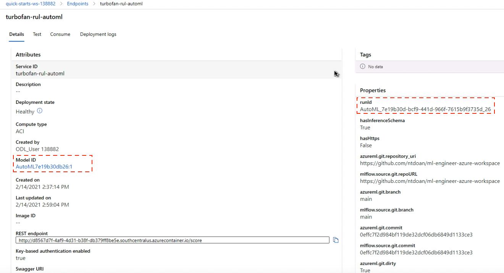

 # Using Azure ML  to build and operationalize machine learning models

- [Using Azure ML  to build and operationalize machine learning models](#using-azure-ml--to-build-and-operationalize-machine-learning-models)
  - [Project setup and installation](#project-setup-and-installation)
  - [Architectural diagram](#architectural-diagram)
  - [Dataset](#dataset)
    - [Overview](#overview)
    - [Preprocessing](#preprocessing)
    - [Task](#task)
    - [Access](#access)
  - [Automated ML](#automated-ml)
    - [Results](#results)
  - [Hyperparameter Tuning](#hyperparameter-tuning)
    - [Results](#results-1)
  - [Future improvements](#future-improvements)
  - [Model Deployment](#model-deployment)
    - [Deployment](#deployment)
    - [Testing](#testing)
  - [Screen Recording](#screen-recording)


The goal of this project was to serve as a step-by-step guide on how to solve a machine learning problem end-to-end using Azure Machine Learning (ML) Studio. Specifically, we used Azure ML studio to build a regression model that predicts the remaining useful life of a fleet of air craft engines. The best model was trained using AutoML and HyperDrive, and subsequently deployed as a web service on Azure, which can be consumed using a http post request.

## Project setup and installation

To run project locally starting from data preparation, install dependencies with:

```bash
curl -sSL https://raw.githubusercontent.com/python-poetry/poetry/master/get-poetry.py | python -
poetry install
```

Activate the environment:
```
poetry shell
```

Download the data from its original [source](https://ti.arc.nasa.gov/tech/dash/groups/pcoe/prognostic-data-repository/) (section Turbofan Engine Degradation Simulation Data Set-2). Set path to where the raw data are stored in [capstone/data.py](capstone/config.py):

```python
DATA_DIR = Path("path_to_location_of_raw_data")
```

Run data preprocessing with:

```bash
python capstone/data.py
```

The above script generated `data/processed/resolution=5min/train.csv` that is used for the modelling experiments. This file was also [hosted](https://www.dropbox.com/s/l9ihi4w0u7mu9h2/train.csv?dl=1) at Dropbox so that it could be accessed during the HyperDrive runs.

Repo structure:
```
.
├── README.md
├── automl.ipynb: notebook used in AutoML experiments
├── capstone: project package
├── config.json: details on Azure suscriptions and workspace
├── data: location of processed data
├── diagrams: used in README.
├── entry_script.py: used in deployment of HyperDrive model.
├── hyperdrive_env: dependency requirements
├── hyperdrive.ipynb: notebook used for HyperDrive experiments
├── hyperdrive.py: training script used in HyperDrive experiments
├── logs.py: enable Application Insights and fetch endpoints log
├── model_artifacts: placeholder to keep model artifacts
├── poetry.lock: poetry's dependency lock file
├── pyproject.toml: poetry's project package management
├── screenshots: used in README.
├── sample_request_data.text: data used for profiling endpoint
└── test_endpoint_hyperdrive.py: test the deployed endpoint
```

## Architectural diagram

The following diagram depicts the main steps of the project.


*Architectural diagram depicting the workflow of the project.*
Briefly, the data, after being downloaded from the orginal source, were subsetted, resampled, and registered to the workspace's datastore prior to the experiments. We configured and run AutoML and HyperDrive experiments to compare the results and select a model for deployment. We enabled Application Insights to monitor the deployed endpoint for abnormalies in performances, and tested it using a http post request with sampled data.

## Dataset
### Overview

In this project, we used a simulated IIOT dataset, which provides a realistic run-to-failure trajectories for a small fleet of aircraft engines under realistic flight conditions. We formulated the machine learning problem as a regression problem. Specifically, we aim to build a model that predicts the remaining useful life (RUL) of a fleet of turbofan units.

The [dataset](https://ti.arc.nasa.gov/m/project/prognostic-repository/Run_to_Failure_Simulation_Under_Real_Flight_Conditions_Dataset.pdf) was published to facilitate research and development on analytical models that can predict the remaining useful life of aircraft engines.

### Preprocessing

The orginal data were provided at 1s resolution. To reduce the computational demand, we:

- randomly selected one of the data batches, named "N-CMAPSS_DS02-006.h5" to include in the experiments.
- resampled all timeseries in the selected batch to 5min resolution to reduce the computational demand.


### Task

We aimed to build a model that predicts remaining useful life of the equipments using the following set of numerical features:

- Flight scenario descriptors (4 features): `"alt"`, `"Mach"`, `"TRA"`, `"T2"`.
- Measurements used for condition monitoring sensors (14 features): `"T24"`, `"T30"`, `"T48"`, `"T50"`, `"P15"`, `"P2"`, `"P21"`, `"P24"`, `"Ps30"`, `"P40"`, `"P50"`, `"Nf"`, `"Nc"`, `"Wf"`.
- Measurements obtained from the simulation software that are not part of the condition monitoring sensors (virtual sensors) (14 features). `"T40"`, `"P30"`, `"P45"`, `"W21"`, `"W22"`, `"W25"`, `"W31"`, `"W32"`, `"W48"`, `"W50"`, `"SmFan"`, `"SmLPC"`, `"SmHPC"`, `"phi"`.


*Schematic representation of the simulation software that generated the data.* [Ref. Arias Chao et al. Data 2021.](https://ti.arc.nasa.gov/m/project/prognostic-repository/Run_to_Failure_Simulation_Under_Real_Flight_Conditions_Dataset.pdf)

From a modelling perspective, this is formulated as a regression problem using multivariate time-series features, all of which are numerical features.


### Access

For illustrative purposes, we accessed the data in two different ways across different types of experiments:

- From Azure's datastore by AutoML. The data were uploaded to the datastore prior to the AutoML experiment.
- From an url within the hyperdrive experiment. The data were hosted in Dropbox and loaded in each child run from a publicly available url.


## Automated ML

We setup the AutoML experiment with the following configurations:

- Sinc our aim was to build a model that provides an estimate of the remaining useful life of an equipment based on a set of features. The task to solve was set as a `regression` task.
- The primary metric to optimize was the (normalized) root mean squared error, which was suggested by the [dataset](https://ti.arc.nasa.gov/m/project/prognostic-repository/Run_to_Failure_Simulation_Under_Real_Flight_Conditions_Dataset.pdf) provider to evaluate how accurate the estimated remaining useful life is to the actual one.
- Automatic [data guardrails](https://docs.microsoft.com/en-us/azure/machine-learning/how-to-configure-auto-features#data-guardrails) (identification of potential issues with the data) and [feature engineering or featurization](https://docs.microsoft.com/en-us/azure/machine-learning/how-to-configure-auto-features#featurization). The latter generated additional features based on a *k*-mean clustering approach. The number of new features was equal to the number of clusters, and each new feature was derived as the distance of a sample to the centroid of each cluster. Given the relatively small number of raw features (`n=32`) compared to the number of samples (`n=17990`), including additional features during the search may increase model performance without the risk of the curse of dimentionality.
- Use cross validation (n=5) to make use of the entire training dataset when training the best AutoML model instead of having to provide an additional validation set. This way the provided training set was randomly split into 5 folds. In each iteration, 1 fold was held out as as validation set and the other 4 folds used for training. The performance was then averaged across 5 iterations.
- Limit the experiment time to 30 minutes due to the limited time of a lab session.


*Run details shown in experiment notebook using the `RunDetails` widget*.


### Results

The best model obtained with the AutoML experiment, which yielded a normalized root mean squared error of `0.1129` (and a root mean squared error of `9.9`), was a pipeline comprising a default `datatransformer` step followed by a [StackEnsemble regressor](https://docs.microsoft.com/en-us/azure/machine-learning/concept-automated-ml#ensemble). In particular, the stack ensamble model consists of a meta-learner, `ElasticNetCV` elastic net regression model with iterative fitting along a regularization path, trained based on the outputs of an ensemble of base learners, including the `LightGBMRegressor`, as can be seen below.


*The best model returned by the AutoML experiment*


*The best AutoML model registered in Azure ML Studio with its registered model ID as well as the ID of the AutoML run that generated the model*.


*Parameters of the `StackEnsemble` regression model*.

## Hyperparameter Tuning

For this regression model, we chose to use the RandomForest regression algorithm, which has been shown to yield high performance in serveral applications. Unlike other regressors such as the linear regressor, this regressor is invariant to the differences in scale across features, and thus it was not necessary to apply any scaler on the features prior to fitting the regressor.

Among several hyperparameters to be tuned for the [RandomForest](https://scikit-learn.org/stable/modules/generated/sklearn.ensemble.RandomForestRegressor.html#sklearn.ensemble.RandomForestRegressor) regressor, to avoid extensive search time, we chose to focus the search on two hyperparameters (`n_estimators`, number of trees to be used, with a range of `[10, 500]`, and `max_depth`, the maximum depth of the tree with a range of `[1, 20]`). We used hyperparameter tunning functionality as provided in HyperDrive.

The `RandomParameterSampling` was used as it randomly searches the parameter space and thus is less time consuming compared to e.g. GridParameterSampling which performs exhausive search over the entire space. `RandomParameterSampling` also supports both continous and discrete hyperparamters.

The `Bandit` policy was used for early stopping policy. It terminates runs where the primary metric, accuracy in this case, is not within the predefined a slack amount compared to the best performing run.


*Run details of the HyperDrive experiment as shown using the `RunDetails` widget in the Jupyter notebook [hyperdrive.ipynb](hyperdrive.ipynb). The best run was run #84*.


### Results

The model with the best performance (`rmse=8.42`) had the optimal parameters of 500 for `n_estimators` and 20 for `max_depth`.


*Run details of the HyperDrive experiment as shown in Azure ML studio. The best run was run #84.*


## Future improvements


- Extend limit in running time to allow AutoML to perform more extensive search.
- Enrich the data by including other batches of data in training.
- As far as model performance is concerned, we would need to test the final model against the provided independent test data to ensure generalizability of the model.
- The best HyperDrive model corresponds to the largest values of the hyperparameters. It is possible that the optimal set falls outside the ranges and thus further expanding the search space may provide improvement.
- Feature engineering to derive new features prior to fitting the model.


## Model Deployment
### Deployment

We deployed the model returned by the HyperDrive experiment which yielded better performance (`rmse=8.42`) than the best AutoML model (`rsme=9.9`).

One advantage of the AutoML model is that it is ready to be deployed once found, whereas a few more steps are required to deploy a model in HyperDrive. The main additional steps required to deploy the HyperDrive model were:

- Fitted the RandomForest regressor with the optimal parameter set.
- Saved the model artifact and registered the model in Azure ML studio.
- Defined an [entry script](entry_script.py) that included an `init` and `run` methods, the former used to initialize the model, and the latter to execute it to give a prediction using the data provided by the http post request during production.
- Defined an inference configuration. This step described how to setup the web service containing the model. We used the same environment as used during training (`AzureML-Scikit-learn-0.20.3`). We declared the inference configuration to use this environment as well as the entry script using `azureml.core.model.InferenceConfig`. A conda dependency [requirement file](hyperdrive_env/conda_dependencies.yml) was also exported for references.
- Defined a deployment configuration using `azureml.core.webservice.AciWebservice`. This step specified the compute target that hosted the web service. We chose to use `Azure Container Instances` with 1 `cpu_cores` and 1 `memory_gb` based on a profiling experiment to estimate the computational resource needed to host the service, which resulted in a recommended CPU of 0.5 and memory of 0.5GB.
- Deployed using `azure.core.model.Model.deploy`.


The mode was deployed as an endpoint with key-based authentication as well as Application Insights enabled. The deployment was done using Azure ML Studio and the Application Insights was enabled using the [logs.py](logs.py) script.


*HyperDrive model deployed as an endpoint.*

### Testing
Testing of the deployed endpoint/webservice was performed using a http post request with two sampled data, as implimented in [test_endpoint_hyperdrive.py](test_endpoint_hyperdrive.py).

The above script was used to send a post request to the deployed webservice using `urllib.request.Request(url, body, headers)`.

where: 
- `url` is the url of the webservice,
- `body` is the payload that contains two samples,
- `headers` contains the primary key for bearer authentication.

With the two-sample payload, we would expect to receive a list of two estimates of remaining useful life from the service.

The test was successful as evidenced by the following screenshot showing two expected results in the response.


*The endpoint was successfully tested.*

## Screen Recording

A demo of the completed project can be seen at this [Youtube video](https://www.youtube.com/watch?v=N0CTfE_V-0w).
