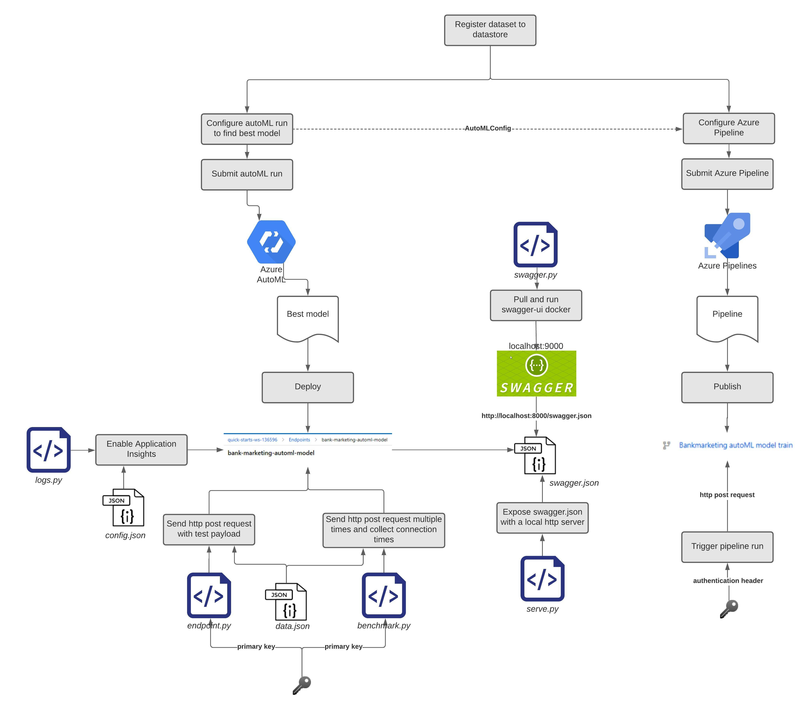
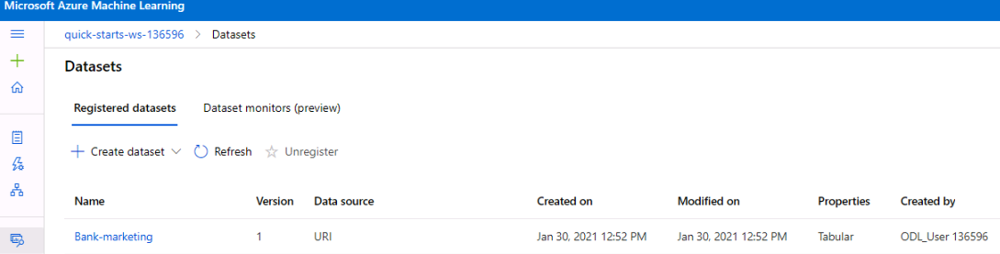
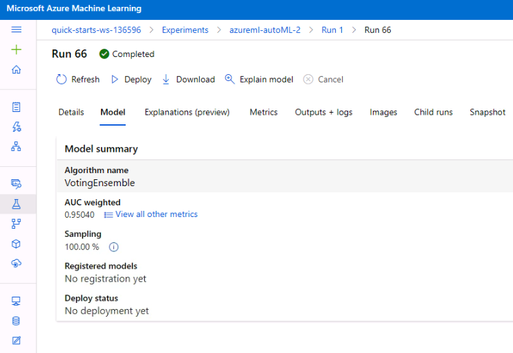
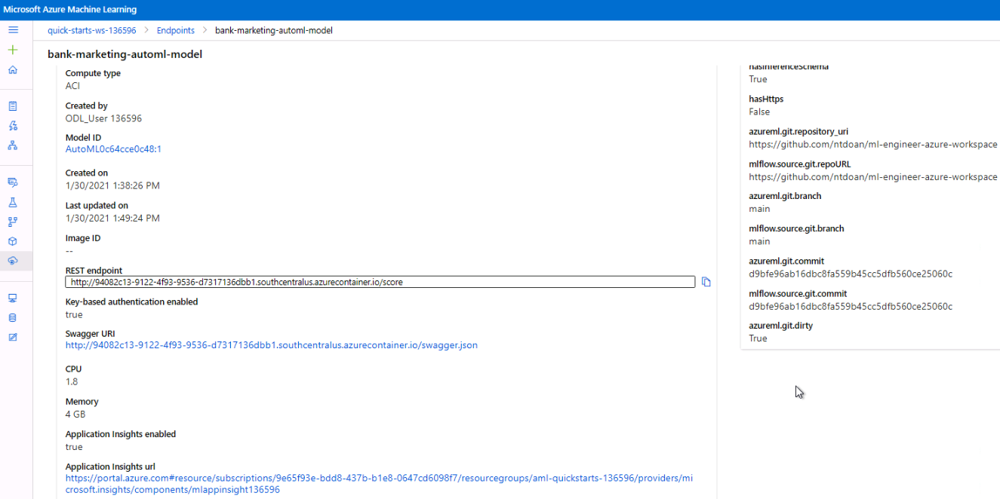
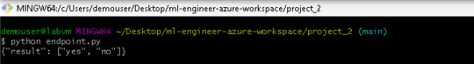
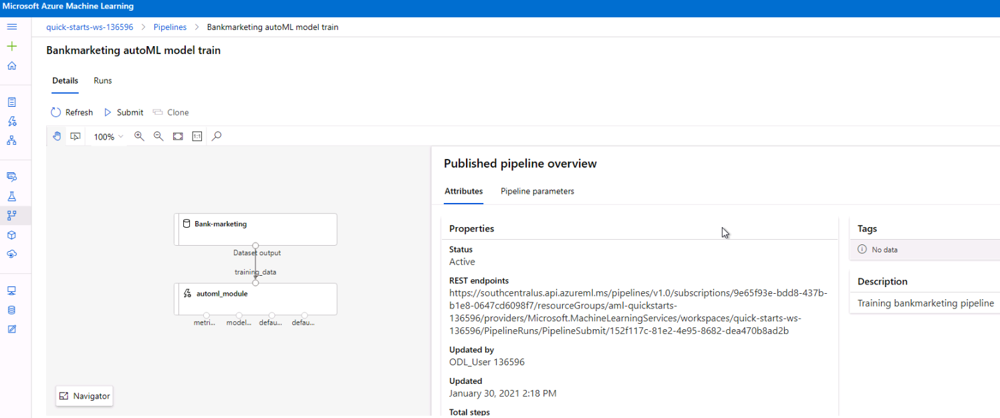
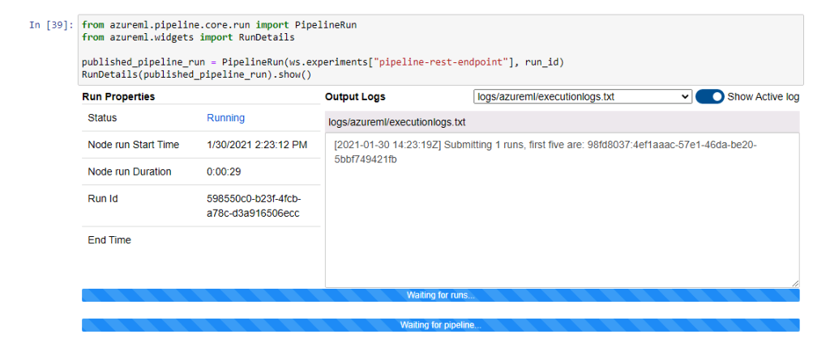
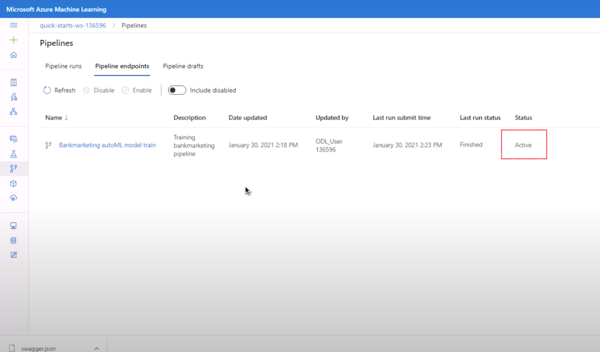
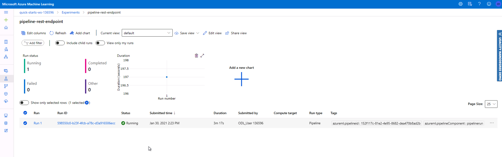
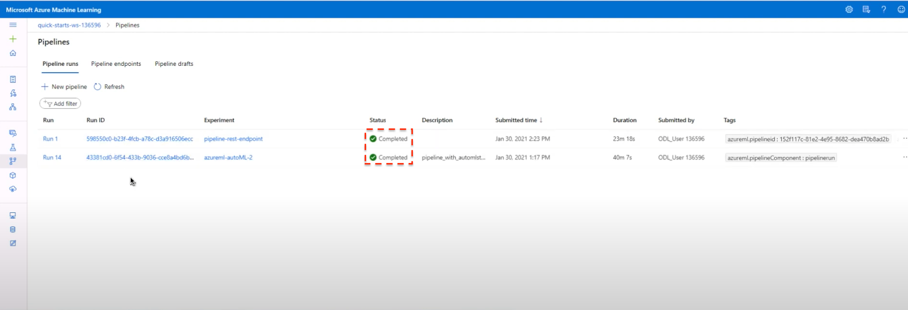

# Operationalizing Machine Learning Model and Pipeline with Azure ML Studio
*Table of content:*

- [Operationalizing Machine Learning Model and Pipeline with Azure ML Studio](#operationalizing-machine-learning-model-and-pipeline-with-azure-ml-studio)
  - [Architectural Diagram](#architectural-diagram)
  - [Key Steps](#key-steps)
    - [Register the dataset](#register-the-dataset)
    - [Configure and run autoML to find best model](#configure-and-run-automl-to-find-best-model)
    - [Deploy best model as a REST endpoint](#deploy-best-model-as-a-rest-endpoint)
    - [Enable Application Insights](#enable-application-insights)
    - [Test the deployed model](#test-the-deployed-model)
    - [Configure and submit autoML pipeline](#configure-and-submit-automl-pipeline)
    - [Publish the pipeline](#publish-the-pipeline)
    - [Trigger pipeline run with a http request](#trigger-pipeline-run-with-a-http-request)
  - [Areas for improvement](#areas-for-improvement)
  - [Screen Recording](#screen-recording)

The goal of this project is to demonstrate a workflow consisting of the following main paths:

- Create, deploy and consume a model using Azure AutoML.
- Create, publish and consume a pipeline using Azure Pipelines.

We use the publicly available [bank marketing](https://automlsamplenotebookdata.blob.core.windows.net/automl-sample-notebook-data/bankmarketing_train.csv) dataset. For this dataset, we aim to build a model that classifies whether a customer is subcribed to a fixed term deposit as a result of a bank telemarketing campaign. 

More details can be seen in the enclosed [Jupyter notebook](project_2_MLOps.ipynb).

## Architectural Diagram

*Architectural diagram of the complete project* 

First of all, we registered the dataset in the datastore of the workspace. Next, we configured and submitted an AutoML run to train the best model. The trained model was then deployed as a REST endpoint with key authentication enabled. We also enabled Azure Application Insights to monitor its performance. We test the consumption of this endpoint using a http post request to verify that it is working properly. Additionally, we also evaluated its performance using ApacheBench (`ab`). We used Swagger to document the `score` endpoint API generated from the AutoML model. 

In addition to the deployed model, we also configured, submitted an Azure Pipeline that trained an AutoML model on the same dataset. This pipeline was also published as a REST endpoint. We tested the consumption of this endpoint by sending an http post request to trigger the pipeline run. 

## Key Steps

### Register the dataset
We use the publicly available [bank marketing](https://automlsamplenotebookdata.blob.core.windows.net/automl-sample-notebook-data/bankmarketing_train.csv) dataset. For this dataset, we aim to train a model that classifies whether a customer subscribes to a fixed term deposit. The target variable, `y`, is a string with one of the following values: `yes`, `no`.

The dataset is registered to the datastore to be used by subsequent modelling steps: 

.

### Configure and run autoML to find best model
To build the model, we used Azure AutoML with the following main configuration: 
- Primary metric: weighted area under the curve (AUC)
- Automatic [data guardrails](https://docs.microsoft.com/en-us/azure/machine-learning/how-to-configure-auto-features#data-guardrails) (identification of potential issues with the data) and [feature engineering or featurization](https://docs.microsoft.com/en-us/azure/machine-learning/how-to-configure-auto-features#featurization) 
- Limit the experiment to 20 minutes to avoid excessive running time. 
- Use cross validation on the training dataset to calculate the evaluation metric.

This run resulted in the best model with a high performance of  0.95 (weighted) AUC. This model was a pipeline consisting of two steps: `dataTransformer` followed by a `prefittedsoftvotingclassifier`, an ensemble of six estimators.

### Deploy best model as a REST endpoint
The best model was then deployed as a REST endpoint intended to be used in production using the `Deploy` feature on the model page on Azure ML Studio:

*Best model deployed as a REST endpoint* 

### Enable Application Insights
[Applicatin Insights](https://docs.microsoft.com/en-us/azure/azure-monitor/app/app-insights-overview) was enabled to monitor the endpoint for abnomalities in terms of performance.

This enabling was done using the `Webservice` class from `azureml.core.webservice`.

### Test the deployed model
We performed a test on the endpoint by sending a http post request with two data samples and the primary key of the endpoint embedded in the request's header. The test was successful as can be seen by the expected response from the endpoint.

*Successul test of endpoint consumption*

### Configure and submit autoML pipeline
Here, we aimed to build a pipeline to automate the process of training the best model for the bank marketing dataset. Note that generally, a pipeline is composed of multiple steps. In this case, we simplify it to have only one step, which is an `automl_step`.

We create a step that consists of an AutoML run, using the same configuration that we used for the autoML run (automl_config):

### Publish the pipeline
After the pipeline was submitted as a run, we published it so that it may be rerun from any http library on any platform using the run's `publish_pipeline` method. The pipeline can also be run manually on the Azure ML studio portal.

*Published pipeline with `ACTIVE` status in Azure ML studio*

### Trigger pipeline run with a http request
We tested the published pipeline by triggering it using an external http post request. The request contained the endpoint itself, an authentication header, and a json payload object. Successful test resulted in a pipeline experiment's run, as can be seen below. 

*Two pipeline runs in two different experiments, one created when submitting the pipeline and one triggered by the http post request on the published pipeline, both of which were successfully completed.*

## Areas for improvement

- With the current setting, the published pipeline would execute an autoML run on the same dataset every time it is used. This is useful for demo purpose only. For the pipeline to have more practical value, it can be set to run every time there is a change in the registered dataset. The motivation is to automatically retrain the model when the production data differ significantly from the data that was used to train the model, necessitating a retrain of the model so that it can work well with new production data. 

- For other datasets which may require a dedicated data preprocessing step rather than using the built in data transformer in AutoML, we may need to insert a `preprocessing` step between the registered data and the AutoML step.

- [Further exploration](https://docs.microsoft.com/en-us/azure/azure-monitor/app/app-insights-overview#how-do-i-use-application-insights) is needed to see how Application Insights can be used in practice to monitor the deployed endpoint.

## Screen Recording
A short introduction of the completed project can be seen at this [youtube video](https://youtu.be/4JVvg1cWHSY).

